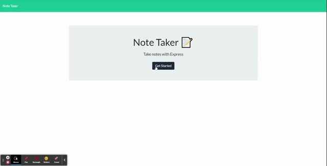

# Note Taker

## Description

The app uses three api calls to get, create, and delete notes. Previously created notes appear in the column on the left. Selecting an existing note displays the contents in the right side column. New notes can be created by selecting the + in the upper right corner, and then entering the notes information in the right column. Existing notes can be deleted by selecting the red trash can next to the note in the left side column.

## Application Link

[link](https://aqueous-dawn-92581.herokuapp.com/)
